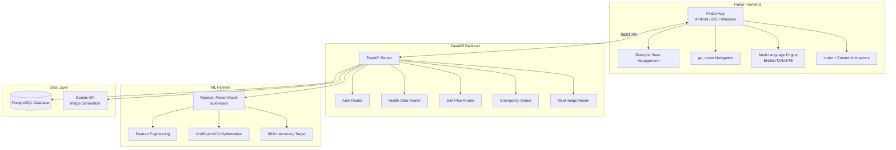
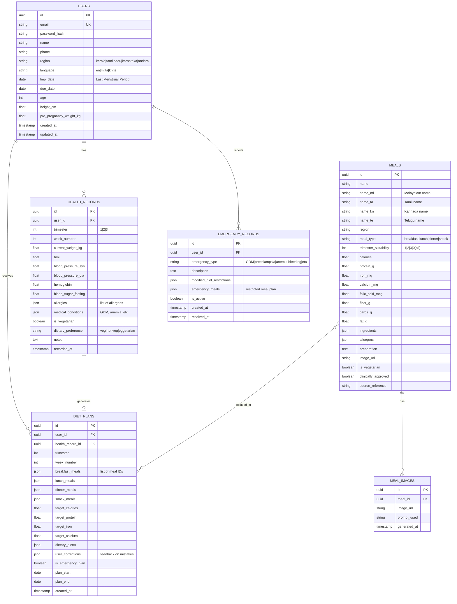
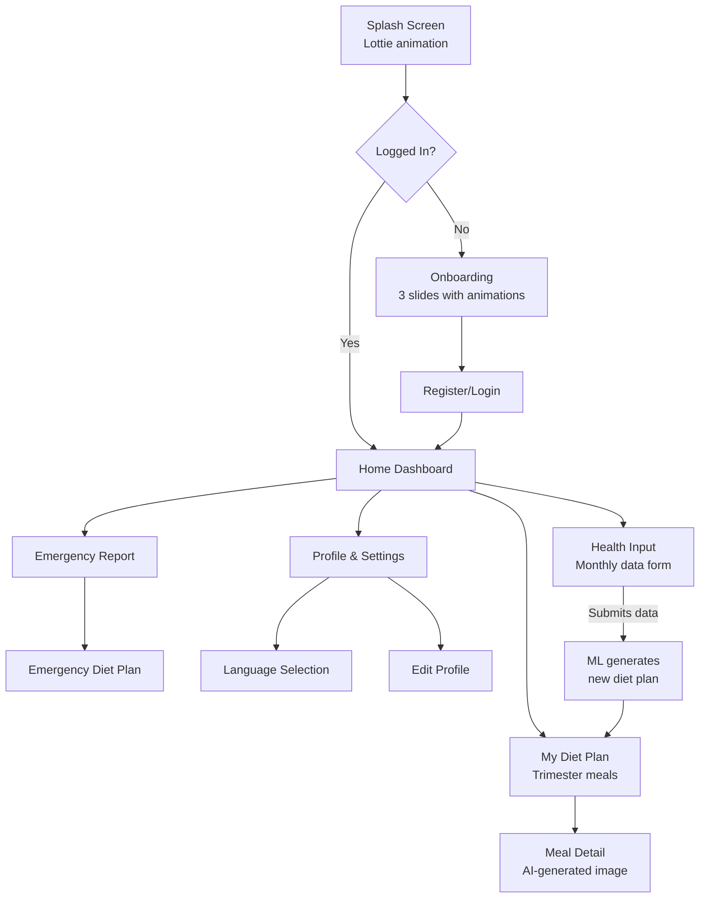

# AlmaDiet — Pregnancy Diet Recommendation App

> A cross-platform (Android, iOS, Windows) pregnancy diet recommendation application using Random Forest ML, FastAPI backend, PostgreSQL database, Gemini AI image generation, and Flutter frontend with professional animations and multi-language support.

---

## User Review Required

> [!IMPORTANT]
> **Database Choice**: You requested PostgreSQL. This requires you to have PostgreSQL installed locally (or use a free cloud instance like Supabase/Neon). Please confirm you have access to a PostgreSQL server.

> [!IMPORTANT]
> **Gemini API Key**: We'll use Google Gemini (free tier via Google AI Studio) for meal image generation. You'll need to create a free API key at [aistudio.google.com](https://aistudio.google.com). Confirm you can do this.

> [!IMPORTANT]
> **Project Location**: All code will be created at `C:\Users\abhin\.gemini\antigravity\scratch\almadiet\`. The Flutter app and backend will be separate directories within this folder.

> [!WARNING]
> **Scope**: This is a massive project (~50+ files). Implementation will be done in phases. Each phase will be fully functional before moving to the next.

---

## Architecture Overview



---

## Project Structure

```
C:\Users\abhin\.gemini\antigravity\scratch\almadiet\
├── backend/                          # FastAPI Backend
│   ├── app/
│   │   ├── __init__.py
│   │   ├── main.py                   # FastAPI app entry point
│   │   ├── config.py                 # Environment config
│   │   ├── database.py               # PostgreSQL async connection
│   │   ├── models/                   # SQLAlchemy ORM models
│   │   │   ├── __init__.py
│   │   │   ├── user.py
│   │   │   ├── health_record.py
│   │   │   ├── meal.py
│   │   │   ├── diet_plan.py
│   │   │   └── emergency.py
│   │   ├── schemas/                  # Pydantic request/response schemas
│   │   │   ├── __init__.py
│   │   │   ├── user.py
│   │   │   ├── health.py
│   │   │   ├── diet.py
│   │   │   └── emergency.py
│   │   ├── routers/                  # API route handlers
│   │   │   ├── __init__.py
│   │   │   ├── auth.py
│   │   │   ├── health.py
│   │   │   ├── diet.py
│   │   │   ├── emergency.py
│   │   │   └── images.py
│   │   ├── services/                 # Business logic
│   │   │   ├── __init__.py
│   │   │   ├── ml_service.py         # Random Forest prediction
│   │   │   ├── diet_service.py       # Diet plan generation
│   │   │   ├── image_service.py      # Gemini image generation
│   │   │   └── alert_service.py      # Dietary alerts
│   │   └── ml/                       # ML model files
│   │       ├── __init__.py
│   │       ├── train_model.py        # Training script
│   │       ├── dataset_generator.py  # Synthetic dataset generator
│   │       ├── model.pkl             # Trained model (generated)
│   │       └── preprocessor.pkl      # Feature preprocessor (generated)
│   ├── data/
│   │   └── meals_dataset.json        # Regional meal database
│   ├── requirements.txt
│   ├── .env.example
│   └── README.md
│
├── frontend/                         # Flutter App
│   ├── lib/
│   │   ├── main.dart                 # App entry point
│   │   ├── app.dart                  # App widget, theme, routing
│   │   ├── core/
│   │   │   ├── theme/
│   │   │   │   ├── app_theme.dart    # Premium theme with gradients
│   │   │   │   └── app_colors.dart   # Color palette
│   │   │   ├── constants/
│   │   │   │   └── api_constants.dart
│   │   │   ├── localization/
│   │   │   │   ├── app_localizations.dart
│   │   │   │   ├── l10n_en.dart
│   │   │   │   ├── l10n_ml.dart      # Malayalam
│   │   │   │   ├── l10n_ta.dart      # Tamil
│   │   │   │   ├── l10n_kn.dart      # Kannada
│   │   │   │   └── l10n_te.dart      # Telugu
│   │   │   ├── widgets/              # Shared animated widgets
│   │   │   │   ├── gradient_card.dart
│   │   │   │   ├── animated_button.dart
│   │   │   │   ├── shimmer_loading.dart
│   │   │   │   ├── pulse_animation.dart
│   │   │   │   └── wave_clipper.dart
│   │   │   └── utils/
│   │   │       ├── api_client.dart   # HTTP client wrapper
│   │   │       └── location_service.dart
│   │   ├── features/
│   │   │   ├── auth/
│   │   │   │   ├── presentation/
│   │   │   │   │   ├── login_screen.dart
│   │   │   │   │   └── register_screen.dart
│   │   │   │   └── data/
│   │   │   │       └── auth_provider.dart
│   │   │   ├── onboarding/
│   │   │   │   └── presentation/
│   │   │   │       └── onboarding_screen.dart
│   │   │   ├── home/
│   │   │   │   └── presentation/
│   │   │   │       ├── home_screen.dart
│   │   │   │       └── widgets/
│   │   │   │           ├── trimester_progress.dart
│   │   │   │           ├── daily_meal_card.dart
│   │   │   │           └── health_summary.dart
│   │   │   ├── health_input/
│   │   │   │   └── presentation/
│   │   │   │       └── health_input_screen.dart
│   │   │   ├── diet_plan/
│   │   │   │   └── presentation/
│   │   │   │       ├── diet_plan_screen.dart
│   │   │   │       └── meal_detail_screen.dart
│   │   │   ├── emergency/
│   │   │   │   └── presentation/
│   │   │   │       └── emergency_screen.dart
│   │   │   ├── profile/
│   │   │   │   └── presentation/
│   │   │   │       └── profile_screen.dart
│   │   │   └── settings/
│   │   │       └── presentation/
│   │   │           └── settings_screen.dart
│   │   └── providers/                # Riverpod providers
│   │       ├── auth_provider.dart
│   │       ├── health_provider.dart
│   │       ├── diet_provider.dart
│   │       └── locale_provider.dart
│   ├── assets/
│   │   ├── animations/              # Lottie JSON files
│   │   └── images/                  # Static assets
│   ├── pubspec.yaml
│   └── README.md
```

---

## Phase 1: Backend Foundation

### 1.1 Database Schema (PostgreSQL)



### 1.2 Technology Stack — Backend

| Component | Technology | Version |
|:---|:---|:---|
| Web Framework | FastAPI | 0.115+ |
| Database | PostgreSQL | 15+ |
| Async ORM | SQLAlchemy 2.0 + asyncpg | Latest |
| ML Model | scikit-learn (Random Forest) | 1.4+ |
| Image Gen | Google Gemini API (free tier) | gemini-2.0-flash |
| Auth | JWT (python-jose) | Latest |
| Validation | Pydantic v2 | Latest |
| Server | Uvicorn | Latest |

### 1.3 Key API Endpoints

| Method | Endpoint | Description |
|:---|:---|:---|
| POST | `/api/auth/register` | Register new user |
| POST | `/api/auth/login` | Login, returns JWT |
| GET | `/api/users/me` | Get current user profile |
| PUT | `/api/users/me` | Update profile |
| POST | `/api/health/record` | Submit monthly health data |
| GET | `/api/health/records` | Get health history |
| GET | `/api/diet/plan` | Get current diet plan |
| POST | `/api/diet/generate` | Generate new diet plan (ML) |
| GET | `/api/diet/alerts` | Get dietary alerts |
| POST | `/api/emergency/report` | Report emergency case |
| GET | `/api/emergency/active` | Get active emergencies |
| GET | `/api/meals/region/{region}` | Get meals by region |
| GET | `/api/meals/{id}/image` | Get/generate meal image |
| POST | `/api/feedback/correction` | Submit diet correction feedback |

---

## Phase 2: ML Model (Random Forest)

### 2.1 Model Design

**Goal**: Predict the optimal meal combination for each user based on their health profile, trimester, region, and medical conditions. Target accuracy: **≥90%**.

**Features (Input)**:
| Feature | Type | Description |
|:---|:---|:---|
| `trimester` | int | 1, 2, or 3 |
| `week_number` | int | 1–40 |
| `age` | int | Mother's age |
| `bmi` | float | Current BMI |
| `weight_gain` | float | Weight gain from pre-pregnancy |
| `hemoglobin` | float | Blood hemoglobin level |
| `blood_sugar` | float | Fasting blood sugar |
| `bp_systolic` | float | Blood pressure (sys) |
| `bp_diastolic` | float | Blood pressure (dia) |
| `is_vegetarian` | bool | Dietary preference |
| `has_gdm` | bool | Gestational diabetes |
| `has_anemia` | bool | Anemia present |
| `has_preeclampsia` | bool | Preeclampsia risk |
| `region_encoded` | int | One-hot encoded region |
| `calorie_need` | float | Calculated daily calorie need |
| `protein_need` | float | Calculated daily protein need |
| `iron_need` | float | Calculated daily iron need |

**Target (Output)**: `meal_plan_category` — a classification label mapping to a meal template group (e.g., "T1_Normal_Kerala_Veg", "T2_GDM_TamilNadu_NonVeg", etc.)

### 2.2 Training Approach

1. **Dataset**: Generate a comprehensive synthetic dataset of **5,000+ rows** using clinically-validated nutritional guidelines (ICMR, NIN) combined with South Indian regional meal preferences.
2. **Preprocessing**: StandardScaler for numerical features, OneHotEncoder for categorical, SMOTE for class balancing.
3. **Optimization**: `GridSearchCV` with 5-fold cross-validation to tune:
   - `n_estimators`: [100, 200, 300, 500]
   - `max_depth`: [10, 15, 20, None]
   - `min_samples_split`: [2, 5, 10]
   - `min_samples_leaf`: [1, 2, 4]
4. **Validation**: Stratified train/test split (80/20), confusion matrix, classification report.
5. **Model storage**: Serialized via `joblib` as `model.pkl` + `preprocessor.pkl`.

### 2.3 Meal Dataset Location

The meal dataset will be stored at: **`backend/data/meals_dataset.json`**

This JSON file contains **200+ clinically-proven South Indian meals** with full nutritional data, regional names in all 5 languages, and allergen information. The same meal names are used as prompts for Gemini image generation to ensure image accuracy.

---

## Phase 3: Flutter Frontend

### 3.1 Technology Stack — Frontend

| Component | Technology | Purpose |
|:---|:---|:---|
| State Management | Riverpod | Reactive, no-context-needed |
| Navigation | go_router | Deep linking, guards |
| HTTP Client | dio | Interceptors, retries |
| Animations | Lottie + Flutter animate | Professional micro-animations |
| Charts | fl_chart | Health tracking visuals |
| Location | geolocator | Region auto-detection |
| Fonts | Google Fonts (Outfit) | Premium typography |
| Image Caching | cached_network_image | Meal image caching |
| Local Storage | shared_preferences | Token + locale persistence |

### 3.2 UI Screens & Flow



### 3.3 Design System

- **Color Palette**: Soft pinks, warm corals, gentle purples — calming and welcoming for pregnant women
- **Primary**: `#E91E8C` (Rose Pink)
- **Secondary**: `#7C4DFF` (Soft Purple)
- **Background**: `#FFF5F9` (Blush White)
- **Cards**: Glassmorphism with frosted glass effect
- **Typography**: Google Fonts "Outfit" — modern, rounded, friendly
- **Animations**:
  - Page transitions: Fade + slide
  - Card animations: Staggered list entry
  - Floating action: Pulse effect
  - Loading: Shimmer skeleton screens
  - Health progress: Animated circular progress
  - Trimester timeline: Animated step indicator

### 3.4 Multi-Language Support

| Code | Language | Region |
|:---|:---|:---|
| `en` | English | Default |
| `ml` | മലയാളം (Malayalam) | Kerala |
| `ta` | தமிழ் (Tamil) | Tamil Nadu |
| `kn` | ಕನ್ನಡ (Kannada) | Karnataka |
| `te` | తెలుగు (Telugu) | Andhra Pradesh / Telangana |

Implementation: Custom `AppLocalizations` class with delegate, loaded from static maps per language.

---

## Phase 4: Gemini Image Generation

### 4.1 Strategy

- Use **Google Gemini 2.0 Flash** model (free tier via Google AI Studio)
- Generate images on-demand when a meal is first viewed
- Cache generated images in the database (`meal_images` table) + serve from backend
- Prompt template: `"Professional food photography of {meal_name}, South Indian cuisine, {region} style, served on a traditional plate, top-down view, warm studio lighting, appetizing presentation"`
- Store generated images as base64 in PostgreSQL or as files on disk

### 4.2 Image Accuracy

To ensure meal images match the actual food:
1. Meal names in English + regional language are included in the prompt
2. Key ingredients are listed in the prompt
3. Regional context (e.g., "Kerala style", "served on banana leaf") is added
4. Generated images are cached — no re-generation unless explicitly requested

---

## Proposed Changes

### [NEW] Backend — `backend/`

All files listed in the project structure above under `backend/`.

#### Key files:
- **`app/main.py`** — FastAPI app with CORS, lifespan events, router registration
- **`app/database.py`** — Async PostgreSQL engine + session factory
- **`app/models/*.py`** — SQLAlchemy 2.0 ORM models (Mapped, mapped_column)
- **`app/routers/*.py`** — API route handlers with dependency injection
- **`app/services/ml_service.py`** — Random Forest model loading + prediction
- **`app/services/image_service.py`** — Gemini API integration for meal images
- **`app/ml/train_model.py`** — Model training script with GridSearchCV
- **`app/ml/dataset_generator.py`** — Synthetic clinical dataset generator
- **`data/meals_dataset.json`** — 200+ South Indian meals with full nutritional data

---

### [NEW] Frontend — `frontend/`

Flutter project created via `flutter create`.

#### Key files:
- **`lib/main.dart`** — Entry point with ProviderScope
- **`lib/app.dart`** — MaterialApp.router with theme + localization
- **`lib/core/theme/`** — Premium design system
- **`lib/core/localization/`** — 5-language localization engine
- **`lib/core/widgets/`** — Reusable animated components
- **`lib/features/*/`** — Feature-first screen organization
- **`lib/providers/`** — Riverpod state providers

---

## Open Questions

> [!IMPORTANT]
> 1. **PostgreSQL Access**: Do you have PostgreSQL installed locally, or should I include Docker setup instructions? Alternatively, would you like to use a free cloud PostgreSQL service like [Neon](https://neon.tech) or [Supabase](https://supabase.com)?

> [!IMPORTANT]
> 2. **Gemini API Key**: Can you create a free Gemini API key at [aistudio.google.com](https://aistudio.google.com)? This is required for meal image generation.

> [!IMPORTANT]
> 3. **Flutter SDK**: Do you already have Flutter SDK installed with Android/Windows support enabled? If not, I'll include setup instructions.

> [!WARNING]
> 4. **Scope Management**: This is a ~50+ file project. I'll build it in phases, each fully testable:
>    - **Phase 1**: Backend + Database + API (testable via Swagger docs)
>    - **Phase 2**: ML Model training + integration
>    - **Phase 3**: Flutter app — core screens + navigation
>    - **Phase 4**: Animations, localization, image generation
>    - **Phase 5**: Polish, testing, error handling
>
>    Is this phased approach acceptable?

---

## Verification Plan

### Automated Tests
- Backend: Run `uvicorn app.main:app --reload` and test all endpoints via Swagger UI at `http://localhost:8000/docs`
- ML Model: Run `train_model.py` and verify classification report shows ≥90% accuracy
- Flutter: `flutter analyze` for zero warnings, `flutter run` on each platform

### Manual Verification
- Submit health data via Flutter app → verify diet plan appears with correct regional meals
- Test emergency flow → verify modified diet plan is generated
- Switch languages → verify all UI text updates correctly
- Check meal images → verify they match the actual food names
- Test on Android emulator, Windows desktop, and (if available) iOS simulator

---

## Prerequisites You Must Install

### Backend
```
1. Python 3.11+           — https://python.org
2. PostgreSQL 15+         — https://postgresql.org (or use Docker / cloud)
3. pip (Python package manager) — comes with Python
```

### Frontend
```
1. Flutter SDK 3.22+      — https://flutter.dev/docs/get-started/install
2. Android Studio          — for Android emulator + SDK
3. Visual Studio 2022      — for Windows desktop support (C++ workload)
4. Xcode (macOS only)      — for iOS support
```

### API Keys
```
1. Google Gemini API Key   — https://aistudio.google.com (free)
```
